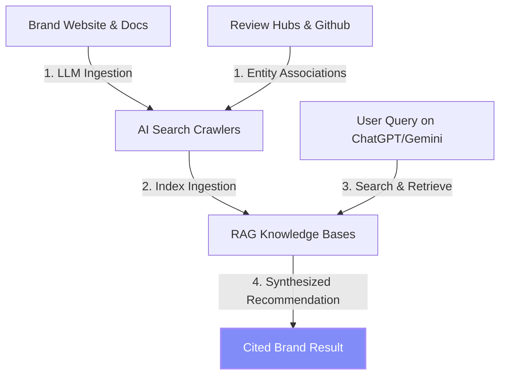
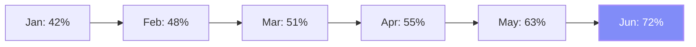

# BRAVISI — AI Brand Visibility Intelligence

Bravisi is a premium, presentation-ready SaaS platform that helps enterprise and B2B brands analyze and optimize their footprint across Large Language Models (LLMs) and Generative Search Engines (e.g., SearchGPT, Google Gemini, Microsoft Copilot, Anthropic Claude).

---

## 💡 The Core Use Case: Why Bravisi Matters

Search is undergoing a fundamental shift. Users are moving away from traditional keyword-matching search engines (Google SEO) and toward conversational, synthesis-driven generative answers (Generative Engine Optimization or **GEO**).

When an enterprise buyer asks an AI assistant:
> *"What is the most secure payment gateway for a global multi-tenant SaaS application?"*

The LLM doesn't return a list of links. It returns a **synthesized paragraph recommending 1 or 2 brands**, citing technical specifications, security standards, and developer documentation.

### The AI Recommendation Funnel
Bravisi diagnoses exactly how LLM crawlers index, perceive, and recommend your brand. It answers critical strategic questions:
1. **Model Share**: Which LLMs recommend us, and where do we lose citation share?
2. **Sentiment & Bias**: What is the semantic association of our brand inside LLM vector spaces?
3. **Source Gaps**: What specific documentation pages, FAQ schemas, or developer registries are missing from the LLM training corpus?



---

## 📊 Platform Dashboard & Core Analytics

Bravisi visualizes your LLM footprints and translates unstructured model behaviors into executive-ready dashboards.

### 1. Model Mention Distribution
Measures the volume of brand mentions across the major AI models. High mention volume indicates strong presence in the training set and citation index of that model.

| AI Assistant | Citation Share | Visual Share Indicator |
| :--- | :---: | :--- |
| **ChatGPT** | 45.6% | `██████████████████░░░░░░░░░░░░` |
| **Gemini** | 32.8% | `█████████████░░░░░░░░░░░░░░░░` |
| **Copilot** | 26.7% | `███████████░░░░░░░░░░░░░░░░░░` |
| **Claude** | 19.6% | `████████░░░░░░░░░░░░░░░░░░░░` |

### 2. Brand Visibility Progression (6-Month Growth Trend)
Track visibility scores (0-100) over time as you apply technical GEO adjustments (e.g. structured data, public developer guides).



### 3. Executive Diagnosis Matrix
The generated report segments recommendations into actionable development cards:
*   🔴 **Critical (Technical SEO / Schema)**: Missing microdata or blocks in `robots.txt` blocking AI user-agents.
*   🟡 **High (Content Gaps)**: Comparison articles, alternative listings, and feature benchmarks required for conversational synthesis.
*   🔵 **Medium (Directory Ingestion)**: Registry updates on G2, ProductHunt, npm, or GitHub to feed the training pipeline.

---

## 🛠️ Tech Stack & Architecture

*   **Frontend Framework**: Next.js 16+ (App Router)
*   **Language**: TypeScript (Strict typing for report payload safety)
*   **Styling**: Tailwind CSS v4 & custom oklch glassmorphism variable system
*   **LLM Processing Backend**: Google Gen AI SDK (`@google/genai` with `gemini-2.5-flash`)
*   **Data Models**: Zod runtime schema validation

---

## ⚙️ Quick Start

### 1. Prerequisites
Ensure you have Node.js 18+ installed.

### 2. Installation
```bash
npm install
```

### 3. API Key Setup
Create a `.env.local` file in the root of the project:
```env
GEMINI_API_KEY=your_google_studio_api_key_here
```
*(Note: `.env.local` is ignored in `.gitignore` to protect API keys).*

### 4. Run Development Server
```bash
npm run dev
```

### 5. Build and Deploy
```bash
npm run build
npm start
```
