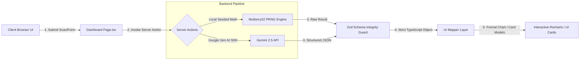

# 🌌 BRAVISI — AI Brand Visibility Intelligence

<div align="center">
  <p align="center">
    
    
    
    
    
  </p>
  
  <p align="center">
    <strong>Benchmark and audit your brand's citation share, semantic sentiment, and training-corpus content gaps across leading Large Language Models (LLMs) and Generative Search Engines.</strong>
  </p>

  <p align="center">
    <a href="#-features">Features</a> •
    <a href="#-visual-interface">Visual Interface</a> •
    <a href="#-the-core-use-case-why-bravisi-matters">Core Use Case</a> •
    <a href="#%EF%B8%8F-how-it-works-two-operational-modes">How It Works</a> •
    <a href="#-architecture--tech-stack-deep-dive">Architecture</a> •
    <a href="#-project-structure">Project Structure</a> •
    <a href="#-installation--quick-start">Installation</a> •
    <a href="#-roadmap">Roadmap</a>
  </p>
</div>

---

## ✨ Features

- **📊 Comprehensive Brand AI Scan**: Instant analysis of citation metrics across **ChatGPT**, **Gemini**, **Copilot**, and **Claude**.
- **🧠 Offline-First Parity**: Zero-setup mock scanning using deterministic PRNG domain-seeding, letting you evaluate dashboard UI features immediately.
- **📑 B2B Executive Report Generator**: Leverages structured AI calls (`gemini-2.5-flash`) to generate deep analysis report matrices of missing corpus entities, content gaps, and roadmap strategies.
- **📈 Advanced Analytics & Radar**: Interactive heatmaps, brand radars, competitor positioning maps, and GEO opportunity matrices.
- **💬 Conversational AI Copilot**: Embedded AI assistant capable of answering custom queries about your brand's AI SEO performance.
- **🧪 Generative Prompt Lab**: Experiment with custom user prompts and queries to diagnose how brand citations trigger.
- **🔍 SEO & GEO Website Audit**: Automated diagnostic audits targeting robots.txt, schema.org tags, entity density, and XML sitemaps.
- **⚖️ Side-by-Side Competitive Analysis**: Benchmark visibility scores against top niche competitors with trend differences.
- **🎯 Dynamic Actionable Insights**: Automatically extracts and prioritizes technical improvements (Structured Schema markups, Robots.txt blockers, Content guides).
- **🖨️ Presentation-Ready PDFs**: Tailored stylesheets optimize the dashboard for physical printing and digital PDF sharing for enterprise stakeholders.

---

## 📸 Visual Interface & Mockups

### 1. Main Dashboard View
```text
+-----------------------------------------------------------------------------------+
|  [<- Back]   (🗲) BRAVISI / Dashboard                                             |
+-----------------------------------------------------------------------------------+
|  [ Trending Up: Metrics Scan ]                     [ File Text: Executive Report ]|
+-----------------------------------------------------------------------------------+
|                                                                                   |
|   Website URL: [ https://example.com ]  Brand Name: [ Acme Corp ] [ Analyze ]    |
|                                                                                   |
|   +-------------------+ +-------------------+ +-------------------+               |
|   | Visibility Score  | | Mention Share     | | Sentiment Index   |               |
|   |       86 / 100    | |       42.5 %      | |     Positive      |               |
|   +-------------------+ +-------------------+ +-------------------+               |
|                                                                                   |
|   Model Mention Distribution (Recharts)     Brand Visibility Trend (6-Month)      |
|   [ ChatGPT ] ██████████████ 45.6%         100% |                      * [86%]    |
|   [ Gemini  ] ██████████ 32.8%              75% |                  *              |
|   [ Copilot ] ████████ 26.7%                50% |            *                    |
|   [ Claude  ] ██████ 19.6%                  25% |      *                            |
|                                                 +----------------------------     |
|                                                    Jan   Feb   Mar   Apr   May    |
+-----------------------------------------------------------------------------------+
```

### 2. B2B Executive Report Preview (Print Layout)
```text
+-----------------------------------------------------------------------------------+
|                                                                                   |
|   =============================================================================   |
|                 AI SEARCH & ENGINE OPTIMIZATION DIAGNOSIS REPORT                  |
|   =============================================================================   |
|   Brand Name: Acme Corp              Niche: B2B Enterprise SaaS                   |
|                                                                                   |
|   [!] Executive Summary:                                                          |
|   "Acme Corp maintains strong technical citation authority inside developer-facing |
|   indices. However, conversational engines lack semantic validation signals..."   |
|                                                                                   |
|   [x] Critical Content Gaps:                                                      |
|   - Topic: "Best Acme Corp alternatives 2025" (Intent: High)                       |
|   - Topic: "Acme Corp security & SOC-2 compliance specs" (Intent: High)           |
|                                                                                   |
|   [+] Tactical Publication Roadmap:                                               |
|   - Title: "Integrating Acme Corp: A Step-by-Step Multi-Tenant Database Guide"     |
|   - Priority: Critical  •  Keywords: multitenant databases, developer schemas     |
|                                                                                   |
+-----------------------------------------------------------------------------------+
```

---

## 💡 The Core Use Case: Why Bravisi Matters

Search is undergoing a fundamental shift. Users are moving away from traditional keyword-matching search engines (Google SEO) and toward conversational, synthesis-driven generative answers (**Generative Engine Optimization** or **GEO**).

When an enterprise buyer asks an AI assistant:
> *"What is the most secure payment gateway for a global multi-tenant SaaS application?"*

The LLM doesn't return a list of links. It returns a **synthesized paragraph recommending 1 or 2 brands**, citing technical specifications, security standards, and developer documentation.

### The AI Recommendation Funnel
Bravisi diagnoses exactly how LLM crawlers index, perceive, and recommend your brand. It answers critical strategic questions:
1. **Model Share**: Which LLMs recommend us, and where do we lose citation share?
2. **Sentiment & Bias**: What is the semantic association of our brand inside LLM vector spaces?
3. **Source Gaps**: What specific documentation pages, FAQ schemas, or developer registries are missing from the LLM training corpus?

---

## ⚙️ How It Works: Two Operational Modes

Bravisi provides dual workflows designed for quick evaluations and high-fidelity enterprise audits.

### 1. Metrics Scan (Zero-Config Offline Mode)
To let developers run the application instantly without configuring credentials, the **Metrics Scan** runs fully local and offline. 

*   **Deterministic Seeding**: It takes the brand website URL, cleanses it, and hashes it using SHA-256 (`crypto.createHash("sha256")`). 
*   **Mulberry32 PRNG**: The first 4 bytes of the hash are converted into a 32-bit unsigned integer seed. This seed initializes a custom `mulberry32` pseudo-random number generator (PRNG).
*   **Consistent Results**: Because of this seeded math, entering the same brand URL and details will *always* generate the exact same scores, graphs, sentiment markers, actions, and competitors.
*   **Well-Known Brands Boost**: Well-known domains (e.g. `google.com`, `apple.com`, `stripe.com`) have hardcoded seed overrides so that these industry leaders reflect realistically high visibility scores (80–97) out-of-the-box.

### 2. Executive Report (Google Gen AI Mode)
The **Executive Report** unlocks the true potential of B2B AI strategy by calling real Gemini models via the `@google/genai` SDK.

*   **Model**: Powered by `gemini-2.5-flash`.
*   **Strict JSON Schemas**: The client configures a nested JSON schema representation using `Type` constants from the SDK. Gemini guarantees the generated text matches this schema configuration exactly before returning.
*   **Strategic Deliverables**: Generates an executive summary, topic content gap analysis with intent ratings, specific B2B publication templates, critical developer registries, and an engineering-focused roadmap.

---

## 🛠️ Architecture & Tech Stack Deep-Dive



### 1. High-Performance Client/Server Separation
Bravisi uses Next.js **App Router (16.2)**. Page components and dynamic chart containers are rendered client-side (`"use client"`) to leverage Framer Motion micro-animations and responsive Recharts rendering. Computational pipelines, data fetches, and Gemini API calls are strictly handled on the server side via **Next.js Server Actions** to protect API keys and reduce browser bundle sizes.

### 2. Seeded Hashing Pipeline
To prevent flickering or state mismatch, the offline generation hashes strings into deterministic numbers:
1. `crypto.createHash("sha256").update(domain).digest()` creates a stable raw binary sequence.
2. `digest.readUInt32BE(0)` extracts the first 4 bytes as a stable seed.
3. The custom `mulberry32` algorithm steps through values to produce uniform random distributions for scores, trends, and content arrays.

### 3. Google Gen AI Integration
The server action hooks into the new, official `@google/genai` SDK. To guarantee type safety, it passes a structured JSON layout definition using nested types:
```typescript
const reportSchema = {
  type: Type.OBJECT,
  properties: {
    visibilitySummary: {
      type: Type.OBJECT,
      properties: {
        score: { type: Type.INTEGER },
        executiveSummary: { type: Type.STRING },
        currentSentiment: { type: Type.STRING, enum: ["Positive", "Neutral", "Negative"] }
      },
      required: ["score", "executiveSummary", "currentSentiment"]
    }
  }
};
```
Gemini processes this model configuration directly on the inference nodes, ensuring the API response parses cleanly into our TypeScript interface.

### 4. Schema Integrity Guard (Zod)
Before mapped objects are sent back to the browser UI, they are forced through a **Zod runtime validator** (`AnalysisResultSchema.parse(result)`). This acts as a database-like runtime barrier, catching structure mutations or API payload drifts instantly.

### 5. UI Mapper Layer
The `src/lib/mappers.ts` file isolates server schemas from UI state models. This ensures if the API payload changes, we only adjust the mapper function instead of updating styles or props in dozens of client files.

---

## 📂 Project Structure

```text
bravisi/
├── src/
│   ├── app/                      # Next.js App Router routes & layouts
│   │   ├── dashboard/            # Brand Strategy Dashboard (Authenticated context)
│   │   │   ├── alerts/           # Brand monitoring and event-driven trigger alerts
│   │   │   ├── analytics/        # Radar strength charts, GEO opportunity heatmaps
│   │   │   ├── api-keys/         # External search / Gemini credentials settings
│   │   │   ├── audit/            # Full-page GEO crawls & technical SEO diagnostics
│   │   │   ├── competitors/      # Side-by-side benchmarking dashboard
│   │   │   ├── content-strategy/ # Generative B2B keyword & content gap suggestions
│   │   │   ├── copilot/          # Embedded brand-knowledgeable chat copilot
│   │   │   ├── prompt-lab/       # Interactive prompt validator & query execution
│   │   │   ├── layout.tsx        # Common dashboard structure (Sidebar + Topbar)
│   │   │   └── page.tsx          # Dynamic scan layout & page coordinator
│   │   ├── globals.css           # Global custom classes (OKLCH variables, animations, glassmorphism)
│   │   ├── layout.tsx            # Main HTML layout wrapper
│   │   └── page.tsx              # Public corporate landing page
│   ├── components/               # React JSX Components
│   │   ├── dashboard/            # Sub-components for visualization
│   │   │   ├── competitor-table.tsx # Comparative tabular layout
│   │   │   ├── insights.tsx      # Gaps and recommended actions
│   │   │   ├── mention-chart.tsx # Recharts bar chart for model distribution
│   │   │   ├── overview-cards.tsx# Score, mention rate, sentiment boxes
│   │   │   ├── professional-report.tsx # Printable B2B audit report layout
│   │   │   ├── score-ring.tsx    # Semi-circular gauge for visibility score
│   │   │   └── trend-chart.tsx   # Recharts area graph for growth timeline
│   │   ├── ui/                   # Shared design system primitive UI elements
│   │   │   ├── sidebar.tsx       # Expandable dashboard navigation tree
│   │   │   ├── topbar.tsx        # Breadcrumbs & user status header bar
│   │   │   ├── dropdown-menu.tsx # Radix-ui interactive dropdown portals
│   │   │   └── dialog.tsx        # Radix-ui overlay modals
│   │   ├── navbar.tsx            # Main website navigation
│   │   ├── hero.tsx              # Animated landing page banner
│   │   └── features.tsx          # Marketing grid items
│   ├── actions/                  # Next.js Server Actions
│   │   ├── analyze-brand.ts      # Offline deterministic scan engine (Mulberry32)
│   │   └── generate-report.ts    # Online Gemini 2.5 structured report integration
│   └── lib/                      # Core utility layers
│       ├── schemas.ts            # Zod validation models
│       ├── mappers.ts            # Schema-to-UI mapper functions
│       └── data.ts               # Fallbacks & typescript interfaces
├── public/                       # Global assets (SVGs, logos)
├── components.json               # Shadcn/Base-UI structure config
├── next.config.ts                # Next.js bundler config
├── postcss.config.mjs            # CSS parsing rules
├── tailwind.config.ts            # Tailwind CSS compiler configs
└── tsconfig.json                 # Strict TypeScript configurations
```

---

## 🚀 Installation & Quick Start

### 1. Prerequisites
- **Node.js**: Version 18.0.0 or higher is required.
- **npm**: Version 9.0.0 or higher is recommended.

### 2. Setup Files
Clone the project and install all dependencies:
```bash
git clone https://github.com/ritikteotia/BRAVISI.git
cd BRAVISI
npm install
```

### 3. API Key Configuration
To unlock the Gemini-powered B2B Executive Report generator, create a `.env.local` file inside the root directory:
```env
GEMINI_API_KEY=AIzaSyYourKeyHere...
```
> [!IMPORTANT]
> Get your API key from the [Google AI Studio Console](https://aistudio.google.com/). Ensure you do not check your `.env.local` file into public repositories; it is already included in the `.gitignore`.

### 4. Running the Dev Server
Launch the Next.js dev server on local port 3000:
```bash
npm run dev
```
Open [http://localhost:3000](http://localhost:3000) inside your web browser.

### 5. Build and Test Production
Build the production optimized site bundle and spin up the next server:
```bash
npm run build
npm start
```

---

## 🗺️ Roadmap

### Phase 1: Core Infrastructure (Current)
- [x] Initial design system with oklch variables and Tailwind CSS v4.
- [x] Deterministic Mulberry32 offline scan simulator.
- [x] Gemini 2.5 structured output API integrations.
- [x] Printable PDF styles for dashboard metrics.

### Phase 2: Historical Auditing (Q3 2026)
- [ ] Database persistence (PostgreSQL/Supabase) to store and load previous brand scans.
- [ ] Historical comparison charts showing monthly visibility progress.
- [ ] Support benchmark scans for up to 5 competitors simultaneously.

### Phase 3: Real-Time Crawler Hooks (Q4 2026)
- [ ] Playwright crawler nodes to search SearchGPT, Gemini Web, and Microsoft Copilot directly in real-time.
- [ ] Customizable diagnostic queries (specific enterprise target questions).
- [ ] Automated scheduled reports via cron.

### Phase 4: Enterprise Hub (H1 2027)
- [ ] Multi-tenant workspace teams.
- [ ] Automated Slack & Email alerts whenever brand citation share drops below a threshold.
- [ ] Public API endpoints for developer instrumentation.

---

## 🤝 Contributing

Contributions, issues, and feature requests are welcome! Feel free to check the [issues page](https://github.com/ritikteotia/BRAVISI/issues) if you want to contribute.

## 📝 License

This project is [MIT](https://choosealicense.com/licenses/mit/) licensed.
